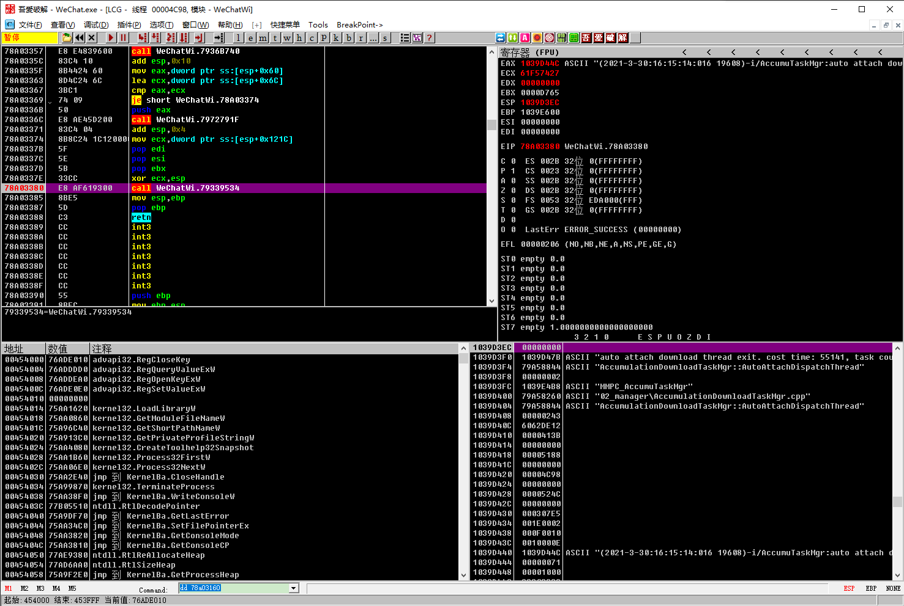

# 微信日志hook

## 智能搜索

1. OD附加微信
2. 点击e，找到WeChatWin.dll模块，双击跳转到汇编界面
3. 右击-> 中文搜索引擎 -> 智能搜索，等待加载完成
4. Ctrl+F, 输入 AddChatMsg，按n，可以搜索下一个结果
5. 找到：MultiDBMsgMgr::AddChatMsg，双击跳转到汇编界面，特征码如下
```asm
7880DC1A    8BC4            mov eax,esp
7880DC1C    68 FC55A679     push WeChatWi.79A655FC                   ; addContactIfNeed Err %s contactId == 0
7880DC21    68 E851A679     push WeChatWi.79A651E8                   ; MultiDBMsgMgr
7880DC26    68 A057A679     push WeChatWi.79A657A0                   ; MultiDBMsgMgr::AddChatMsg
7880DC2B    8948 08         mov dword ptr ds:[eax+0x8],ecx
7880DC2E    B9 04000000     mov ecx,0x4
7880DC33    68 7C020000     push 0x27C
7880DC38    C600 02         mov byte ptr ds:[eax],0x2
7880DC3B    E8 20551F00     call WeChatWi.78A03160
```
6. 在下面的call中断点，按F7单步，里面应该就有打微信日志的函数。PS：如没断下，可以直接在Call右击->跟随，直接跳到这里面去找，然后下断点。如下图，eax里面就保存有日志。


## Hook偏移

```asm
基址：64600000
Call：64B73380    E8 AF619300     call WeChatWi.654A9534                   ; 日志hook-yes
```

Hook偏移 = 64B73380 - 64600000 = **0x5734FE**
OriginCall = 654A9534 - 64600000 = **0x**