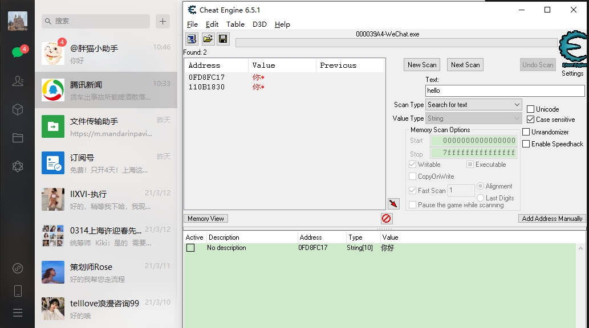
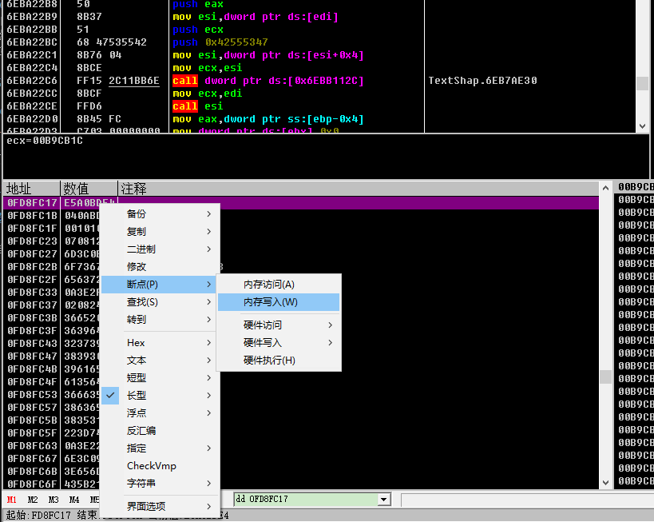
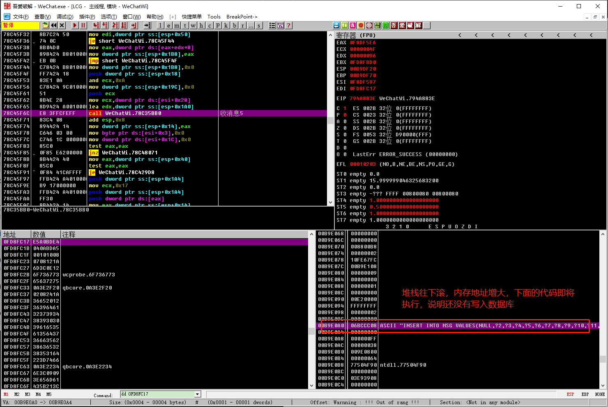

# 收消息hook

这次做一个改变，我计划在不看视频的情况下尝试找出收消息的Hook，并且实现收文本消息的Demo（为了简化，先只考虑能收到文本消息。通过开源项目，会有个消息类型来区分，Hook的时候要注意处理）。

## 思路

首先，微信有本地SQLite数据库，他收到一条消息肯定会写入到数据库里面（数据库可以通过解密工具解密后使用SQLite Expert查看），所以我的目标是找到这个Call，然后Hook取数据。

参考找通讯录列表的思路：
1. 我们需要使用另外一个微信给调试的微信发消息，然后使用CE搜索这一串字符串（Unicode）
2. 不停的发消息，排除一部分地址
3. 使用OD附加调试，dd 到某一个地址，下内存写入断点
4. 反复的找Call，以及在堆栈界面，找“返回到 WeChatWin.dll+xxx”之类的，右键点击“跳转到汇编窗口”然后下断点，加注释
5. 通过第4步，反复的观察

## 实战记录

### 找存储消息的内存地址

 
 

### 下内存写入断点  

堆栈界面往下滚，看见“返回到 WeChatWi.78C38E95 来自 WeChatWi.78C168D0”之类的，就右击“反汇编窗口中跟随”，下断点加注释。

然后再往下滚，看见了一个sql插入语句，说明这个地址应该是对的，接下来就是排除上面“返回到 xx”的Call哪一个附近有数据了。

> PS：找到这些Call下好断点之后，那个地址的内存写入断点就可以取消了

  

最新消息：05AAEF44 

写入：
55169FF5    66:8907         mov word ptr ds:[edi],ax

调用：
5484C5EE    E8 E9D99100     call WeChatWi.55169FDC                   ; 堆栈1

### 其他

05F3F2A4  05FB115C  UNICODE "459"

0BE7F87C 这里信息多一些

这里是会话列表的信息
0BDEC6D4  060DDC00  UNICODE "PANMAOXIAOZHUSHOU"
0BDEC6D8  00000011
0BDEC6DC  00000011
0BDEC6E0  00000000
0BDEC6E4  00000000
0BDEC6E8  06132C70  UNICODE "@胖猫小助手"
0BDEC6EC  00000006
0BDEC6F0  00000006
0BDEC6F4  00000000
0BDEC6F8  00000000
0BDEC6FC  0603ADE0  UNICODE "459"

0675D945 lass SyncMgr

1.搜索 wxid wxid_i06tno1tqk0612
2.搜索 msgsource

## 问题记录

### 勾选了Unicode反而搜索不到收到的消息内容

需要取消勾选Unicode，来搜索接收到的消息。