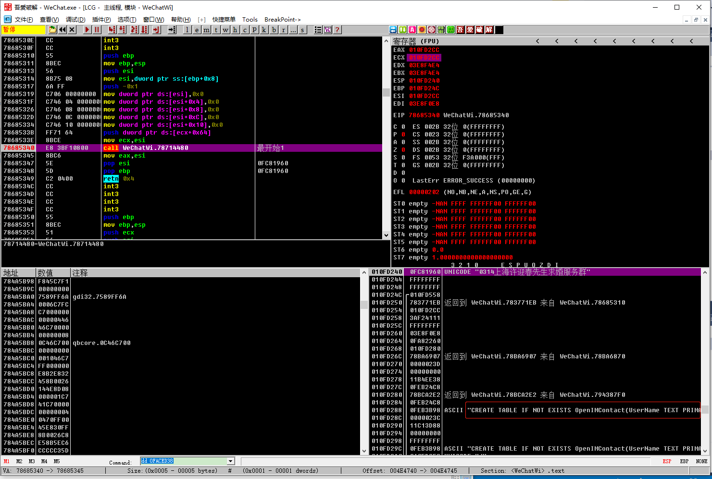
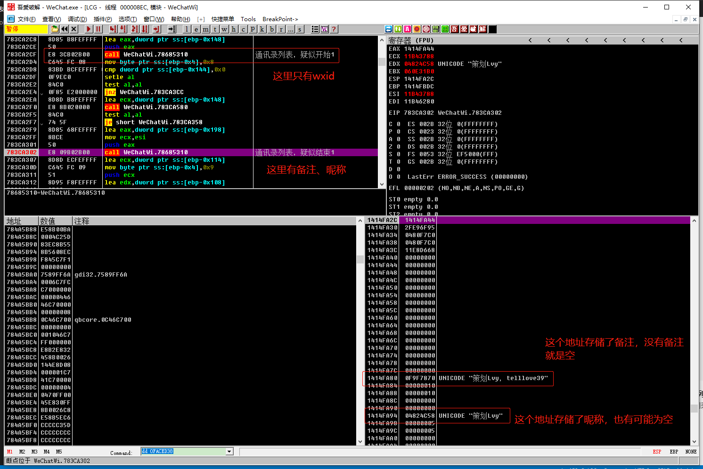
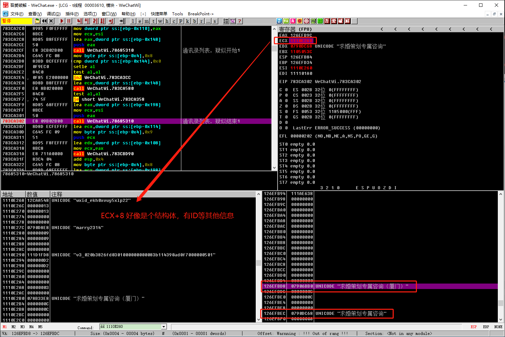

# 好友列表

## 思路

根据《2019PC微信HOOK逆向分析：实战分析微信好友群列表hook地址》视频里面的介绍，主要有如下2种方式：
- Hook内存
- 解密数据库，直接查询

因为解密数据库会引入额外的复杂性和带来延迟，优选第一种方式。

在视频中，他假设微信是通过一个函数来获取用户详细信息的（通常编程中我们也会这样干，通过一个ID去查询用户信息，而微信本身这些好友信息是通过sqlite存储的，所以这个假设完全正确），这个时候只需要找到这个Call，进行Hook就能循环得到好友列表了。

怎么找Call？来看下面

## 步骤

### 初步找获取好友信息Call

1. 在通讯录界面任意选择一个好友，复制其微信号（选wxid_开头），在CE里面搜索（String类型，勾选Unicode）
2. 点击另外一个好友（微信号也是wxid_开头），CE里面把wxid_这一串微信号拷贝进去点击Next Scan，此时结果会少很多
3. 重复步骤2几次，直到结果有2-4个左右，在CE把他们添加到addresslist
4. 此时任选1个地址，在OD中下内存写入断点
5. 单击一个好友信息，OD断住，通过堆栈窗口，往下滚找"返回到 WeChatWi.783923AE"，右击选择“反汇编窗口中跟随”，然后下断点，加备注。
6. 多找几个"返回到 WeChatWi.783923AE"下断点，往下滚的过程中，能看到“UNICODE "wxid_rflfrdlfwolm22"”“UNICODE "qiushuan_lucky"”等字样，说明那个Call就在附近。
7. 不停的F8，找可能的Call

### 验证Call

上面找到一些疑似的Call之后，我们要确定那个Call会在用户登录的时候调用，视频里面是通过**删除好友**的方式，我感觉比较麻烦。

无意间，在登录的时候，我发现之前有个Call被调用了，看寄存器用户的昵称会不停的改变，感觉就是这个Call来获取好友信息的。

所以总结下来要验证Call有一下几个时机：
- 点击设置时
- 登录后
- 会话页面，选择某个人查看消息时
- 新消息闪烁，鼠标悬停时

我比较推荐通过**重新登录**的方式来验证，因为会多次调用这个Call，所以我们对Hook到的好友进行**去重操作**。

## 实例

### 设置界面排除Call

我们拿点击“设置”为例，里面有个人微信昵称、微信号，也会调用Call，但是比好友列表的信息少，会好分析一下。

```bash
文本：野生植物
疑似开始 
获取好友疑似4
最后显示1

文本：微信号：xmcy0011
疑似开始
获取好友疑似4
最后显示1
```

通过几个断点，我发现每个文本都会执行一次循环，初步判断这个Call可能是获取某个字段的，应该不是我们要找的。

### 重新登录排除Call



如上图，除了显示昵称外，在堆栈窗口下面还发现了SQL语句，大概率就是这里了。但是**不排除是会话列表，而不是好友列表**，所以放掉，记录一下进入的次数，是不是和通讯录里面的好友个数匹配。

第一波：
```h
010FD240   0FD4F620  UNICODE "语音记事本"
010FD240   0FF6D8D0  UNICODE "腾讯新闻"
010FD240   11C8B4A8  UNICODE "A.好好先生求婚策划"
010FD240   117EC390  UNICODE "策划师Rose"
010FD240   0FF6D798  UNICODE "持续进步"
010FD240   11C8B528  UNICODE "邱栓-菊联路一店链家"
010FD240   0FF6D888  UNICODE "链家地产王婷婷"
010FD240   0FF6D960  UNICODE "迈瑞米策划"

010FD000   11A1C450  UNICODE "0314上海许迎春先生求婚服务群"
010FD000   0FD05110  UNICODE "订阅号"
010FD000   0616C338  UNICODE "文件传输助手"
010FD000   11CE5DB0  UNICODE "朋友推荐消息"
010FD000   11CE5E10  UNICODE "腾讯新闻"
010FD000   11CE5048  UNICODE "策划师Rose"
010FDB50   0FBBB930  UNICODE "文件传输助手"

12A1F77C   11C8C4F8  UNICODE "0314上海许迎春先生求婚服务群"
12A1F77C   11C8C4F8  UNICODE "0314上海许迎春先生求婚服务群"
12A1F77C   0FBBC1B8  UNICODE "IIXVI"
12A1F77C   0601A570  UNICODE "漂流瓶"
12A1F77C   0FBBC740  UNICODE "浪漫咨询99"
12A1F77C   0FBBC740  UNICODE "浪漫咨询99"
12A1F77C   0F9A01A0  UNICODE "求婚策划专属咨询"
12A1F77C   05FB2D90
```

好像不对，缺少了一些好友。堆栈里面继续找Call，继续找“返回到 WeChatWi.783923AE”之类的Call，下断点，第二波：
```h
010FD240   047B1830  UNICODE "0314上海许迎春先生求婚服务群"
010FD240   0FF6D7F8  UNICODE "文件传输助手"
010FD240   11FF0E50  UNICODE "漂流瓶"
010FD240   0FF6D840  UNICODE "朋友推荐消息"
010FD240   0FF6DA98  UNICODE "上海本地宝"
010FD240   0FF6DA38  UNICODE "语音记事本"
010FD240   11993D68  UNICODE "腾讯新闻"
010FD240   11A1EDC8  UNICODE "A.好好先生求婚策划"
010FD240   11993FD8  UNICODE "策划师Rose"
010FD240   11993DF8  UNICODE "持续进步"
010FD240   11A1ECE8  UNICODE "邱栓-菊联路一店链家"
010FD240   11993D50  UNICODE "链家地产王婷婷"
010FD240   11994068  UNICODE "迈瑞米策划"

010FD000   119A92B8  UNICODE "0314上海许迎春先生求婚服务群"
010FD000   11FF0F10  UNICODE "订阅号"
010FD000   0FF6CC28  UNICODE "文件传输助手"
010FD000   0FF6CB68  UNICODE "朋友推荐消息"
010FD000   0FF6CD30  UNICODE "腾讯新闻"

010FD000   11F28898  返回到 11F28898
010FDB50   0FBB9ED8  UNICODE "文件传输助手"
12CEF97C   0FEB7A18  UNICODE "0314上海许迎春先生求婚服务群"
12CEF97C   0FEB7A18  UNICODE "0314上海许迎春先生求婚服务群"
12CEF97C   11F28F40  UNICODE "IIXVI"
12CEF97C   11F28E98  UNICODE "文件传输助手"
12CEF97C   11F28E98  UNICODE "文件传输助手"
12CEF97C   0FD05398  UNICODE "漂流瓶"
12CEF97C   0FD05398  UNICODE "漂流瓶"
12CEF97C   11F28D90  UNICODE "朋友推荐消息"
12CEF97C   11F28D90  UNICODE "朋友推荐消息"
12CEF97C   11F28E50  UNICODE "上海本地宝"
12CEF97C   11F28E50  UNICODE "上海本地宝"
12CEF97C   11F274D0  UNICODE "语音记事本"
12CEF97C   11F274D0  UNICODE "语音记事本"
12CEF97C   0FBB9508  UNICODE "A链家新房陈雪宝,17502170547"
12CEF97C   0FBB9508  UNICODE "A链家新房陈雪宝,17502170547"
12CEF97C   11F28DC0  UNICODE "策划Lvy"
12CEF97C   11F28DC0  UNICODE "策划Lvy"
12CEF97C   11B48E90  UNICODE "A.好好先生求婚策划"
12CEF97C   11B48E90  UNICODE "A.好好先生求婚策划"

12CEF97C   11F275C0  UNICODE "浪漫咨询99"
12CEF97C   11F275C0  UNICODE "浪漫咨询99"
12CEF97C   11B47250  UNICODE "求婚策划专属咨询"
12CEF97C   11B47250  UNICODE "求婚策划专属咨询"
```

好像还是不对，根据上面的规律分析，第一波和第二波都会有个循环，猜测第一次可能是**加载会话列表**，第二次是**加载通讯录列表**。所以在往这个Call的外面找，看是那个Call调用了，我们只需要通讯录列表的好友，这样就能针对性的处理了。

后续反复验证，确定**第二次循环才是通讯录列表**加载，**第一次是会话列表加载**。

WeChatWin.dll 3.1.0.69 版本通讯录加载列表如下：



## 偏移

### 通讯录列表

Call地址：
```asm
783CA302    E8 09B02B00     call WeChatWi.78685310                   ; 通讯录列表，疑似结束1
```

```asm
EAX 1414FA44
ECX+8 1110B380

1110B388  07922450  UNICODE "23522402174@chatroom"
10DDFA7C   04699110  UNICODE "策划Lvy，telllove39"
10DDFA90   05BC4B00  UNICODE "策划Lvy"
```

通讯录列表Hook（登录后过几秒调用）：783CA302-781A0000=0x22A302
通讯录列表原Call：0x78685310-781A0000=0x4E5310

微信ID：ECX+8
微信号：ECX+1C
备注：ECX+50（群没有）
名称：ECX+64

### 通过ID获取详细信息Call（各种地方都会调用）

> 警告：未验证

```asm
783923B4    E8 572F2F00     call WeChatWi.78685310                   ; 好友详情-最开始1
```

hook=783923B4-781A0000=0x1F23B4